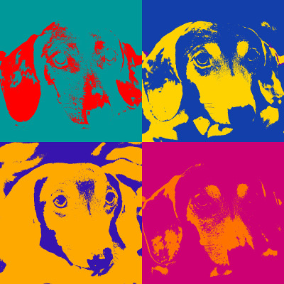

# warhol

Create simple warhol-like artworks from digital images.

## Installation

$ go get github.com/atongen/warhol

## Usage

$ warhol [OPTIONS] path/to/image.jpg

Options:
  -o=".": outdir (shorthand)
  -outdir=".": Output directory
  -s=3: size (shorthand)
  -size=3: Size of output grid, valid values are 3 (3x3), 2 (2x2), or 0 (do not assemble final image)

## Contributing

1. Fork it
2. Create your feature branch (`git checkout -b my-new-feature`)
3. Commit your changes (`git commit -am 'Add some feature'`)
4. Push to the branch (`git push origin my-new-feature`)
5. Create new Pull Request
