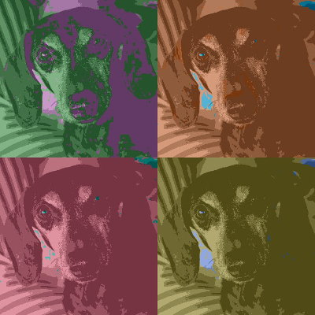

# warhol

Create simple warhol-like artworks from jpg or png images.

This is a small side project that I used to experiment with color spaces (LAB),
and color comparison algorithms.



## Installation

$ go get github.com/lucasb-eyer/go-colorful
$ go get github.com/atongen/warhol

## Usage

```
$ warhol [OPTIONS] path/to/image.(jpg|png)

Options:
  -h    Print help and exit
  -hue int
        starting hue 0-359, default is random (default -1)
  -no-stretch
        skip stretching contrast of original image
  -o string
        Output file
  -quiet
        Quiet mode
  -s int
        nxn size of output grid, ie. 2x2, 3x3, etc. (default 3)
  -v    Print version and exit
```

## Contributing

1. Fork it
2. Create your feature branch (`git checkout -b my-new-feature`)
3. Commit your changes (`git commit -am 'Add some feature'`)
4. Push to the branch (`git push origin my-new-feature`)
5. Create new Pull Request
